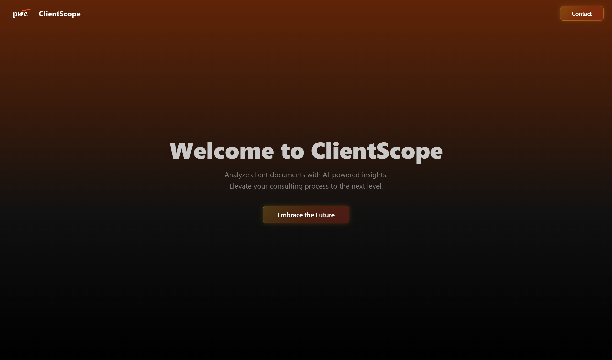
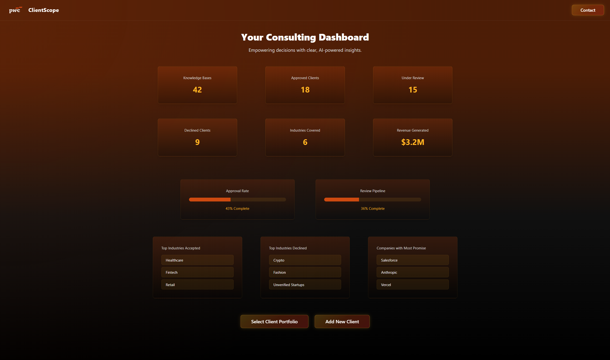
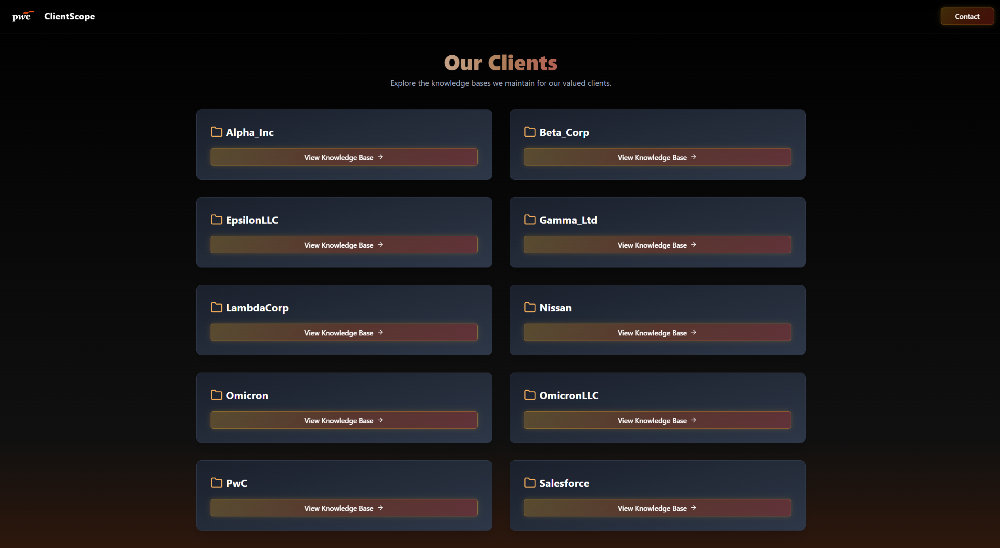
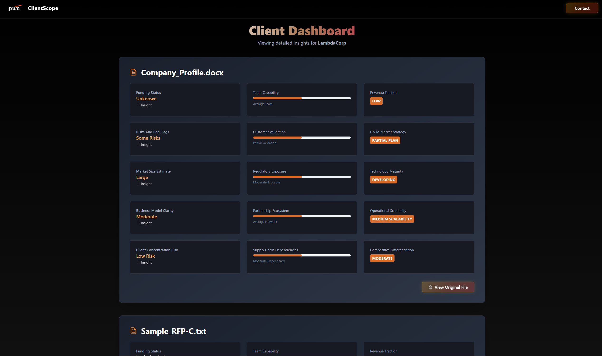
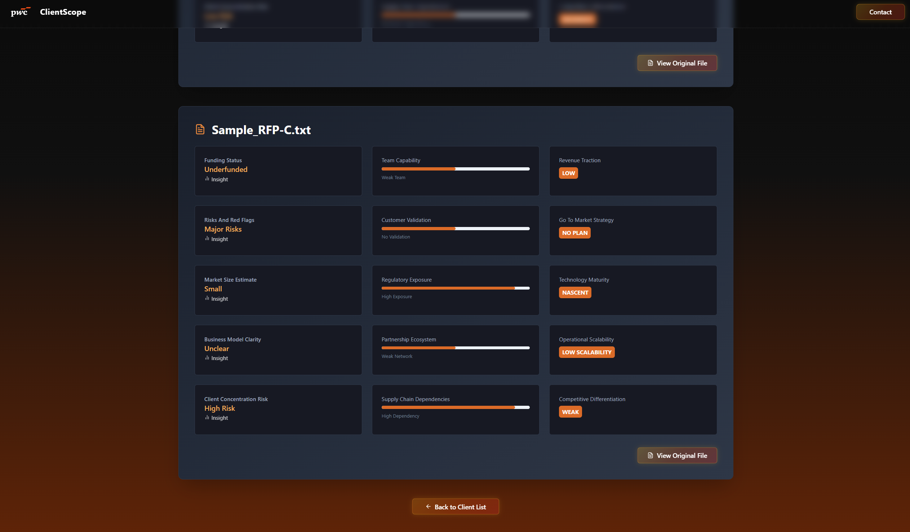
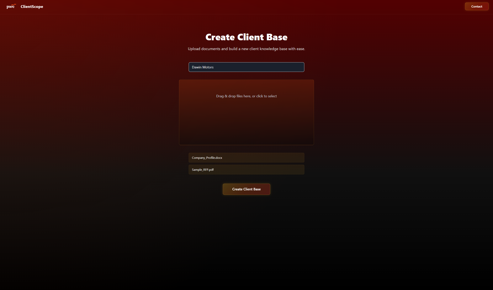

# ClientScope - **PwC Hackathon Winner Project**

---

## What Problem was Solved

Consulting and due diligence teams spend countless hours reviewing client documents—pitch decks, RFPs, company profiles—and manually extracting structured insights to evaluate viability, financial metrics, and business details. This process is slow, inconsistent, and highly resource-intensive.

---

## The Idea

ClientScope is an AI-powered platform that streamlines this entire workflow:

- Users can **upload multiple client documents** (PDFs, DOCX) through a drag-and-drop interface.
- The backend uses **OpenAI GPT-4** to automatically extract:
  - Concise summaries
  - Detailed structured information (industry, revenue, business model, SWOT analysis, KPIs, etc.)
  - Viability recommendations
- Files are stored securely in **Supabase Storage**, and structured metadata is saved in a Supabase database.
- Users can manage their knowledge base, track approval status, and view key metrics in a unified dashboard.

In essence, ClientScope is a combination of document storage, AI summarization, and consulting workflows into one platform.

---

## Features

| Feature                              | Description                                                                                          |
|--------------------------------------|------------------------------------------------------------------------------------------------------|
| Multi-File Upload                    | Drag and drop multiple documents (PDF, DOCX)                                                        |
| AI Summarization                     | GPT-4 generates structured, detailed JSON summaries                                                 |
| Knowledge Base                       | Centralized repository of all clients                                                               |
| Client Dashboards                    | Per-client dashboards showing summaries, file lists, and progress                                   |
| Approval Tracking                    | View counts of approved, declined, and under-review clients                                         |
| Metrics Dashboard                    | Key performance metrics such as revenue generated, industries covered                               |
| Secure Storage                       | Supabase Storage for file hosting, with public or private URLs                                      |
| Beautiful UI                         | Chakra UI-based design for modern, clean interfaces                                                 |

---

## Tech Stack

| Layer     | Technologies                                                                 |
|-----------|------------------------------------------------------------------------------|
| Frontend  | React + Vite, Chakra UI, Axios                                              |
| Backend   | Node.js + Express, Multer, pdf-parse, mammoth, OpenAI GPT-4, Supabase       |
| Deployment| GitHub, Vercel/Render/Fly.io (future-ready)                                 |

---

## Impact of the Solution

- **Reduces review time** per client profile from hours to minutes.
- **Improves consistency** and insight quality.
- **Enables scaling** without proportional increases in headcount.
- **Centralizes knowledge** into a single platform for collaboration and transparency.

---

## Future Potential

We envision expanding ClientScope into a full consulting suite with capabilities such as:

- Integrated **CRM workflows**
- Automatic **relationship mapping** across clients
- **RAG-based question answering** over all stored client content
- **Custom analytics dashboards** for individual consultants
- **Approval workflows and audit trails**
- API integrations with Salesforce, Slack, and other productivity tools

---

## How to Use

1. Upload documents from the **Knowledge Base** page.
2. The AI will automatically process and summarize each file.
3. View structured insights in the **Client Dashboard**.
4. Track approval status and performance metrics in the **Dashboard**.
5. Quickly access and review any client’s information at any time.

---

## Contact

Pranit Singh Gandhi: [LinkedIn](https://www.linkedin.com/in/pranit-gandhi/)
